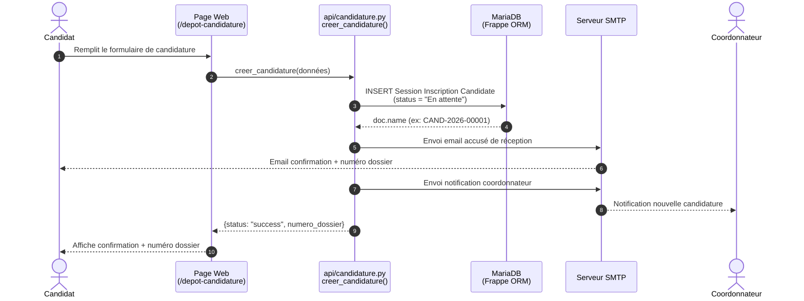
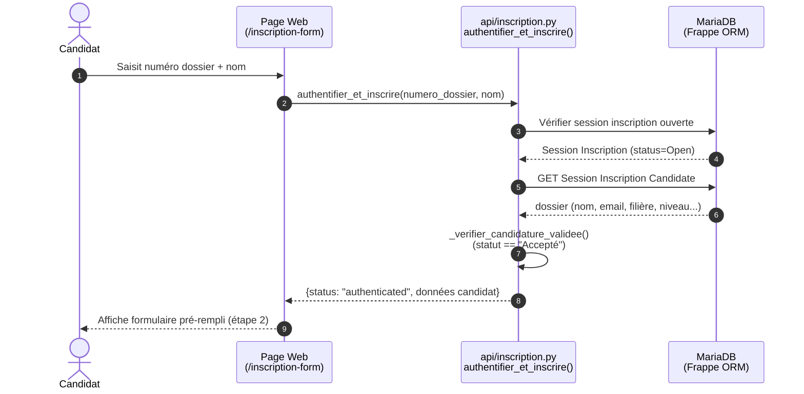
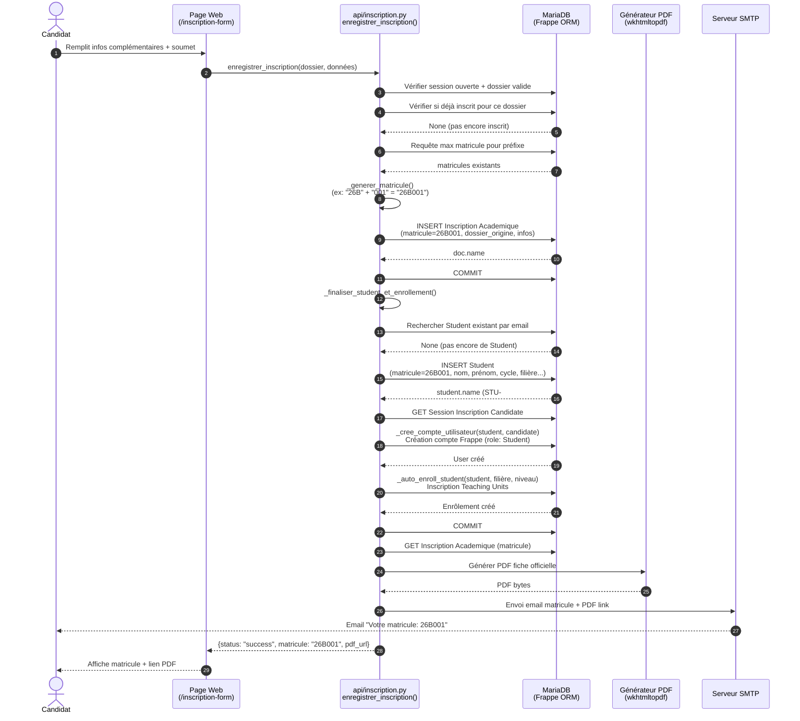
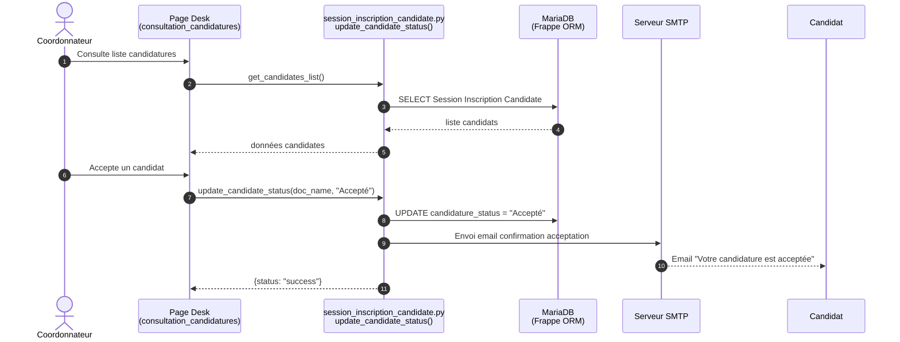
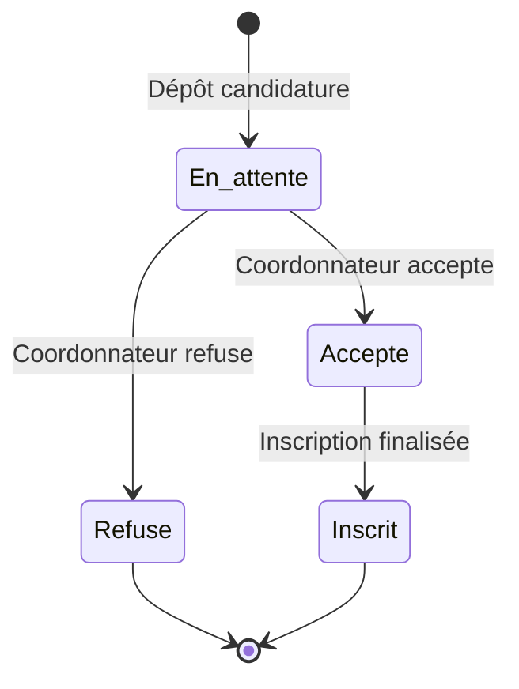

# Diagramme de Séquence — Module d'Inscription

## Flux global : Candidature → Inscription

## Flux d'authentification et d'inscription

## Flux d'enregistrement de l'inscription

## Flux de validation par le coordonnateur

## Résumé des états du candidat

